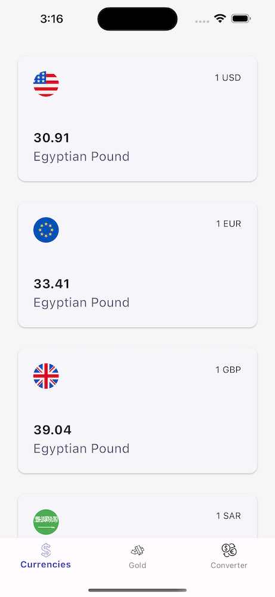

# Currency Converter

This project is a currency converter application that allows users to track the currency exchange
rates between Egyptian pounds (EGP) and dollars (USD), as well as recent gold prices in Egyptian
Pound (EGP). It also provides a feature to convert between EGP and USD based on the current exchange
rates.

## Project Description

The application is built using Flutter and Dart. It uses the Bloc state management library to manage
the application state. The application fetches data from two public APIs to get the current exchange
rates and gold prices.

## APIs Used

- [Exchange Rates API](https://exchangeratesapi.io/) - This API is used to get the current exchange
  rates between different currencies.
- [Gold API](https://www.goldapi.io/) - This API is used to get the current gold prices in EGP.

## Screenshots




## Getting Started

These instructions will get you a copy of the project up and running on your local machine for
development and testing purposes.

### Prerequisites

- Android Studio Giraffe | 2022.3.1 Patch 2
- Dart SDK
- Flutter SDK

### Installing

1. Clone the repository
   ```git clone https://github.com/Muhammad-Gamal2/currency-converter.git```
2. Navigate to the project directory
   ```cd currency-converter```
3. Get the dependencies
   ```flutter pub get```
4. Run the app
   ```flutter run```
5. Build files from code generation
   ```flutter packages pub run build_runner build```

## Running the tests

To run the tests, use the following command in the terminal:

```
flutter test
```

## Built With

- [Flutter](https://flutter.dev/) - The UI framework used
- [Dart](https://dart.dev/) - The language used
- [Bloc](https://bloclibrary.dev/#/) - State management
- [Dio](https://pub.dev/packages/dio) - HTTP client for making requests

## Authors

- **Muhammad Gamal** - *Initial work* - [Muhammad-Gamal2](https://github.com/Muhammad-Gamal2)

